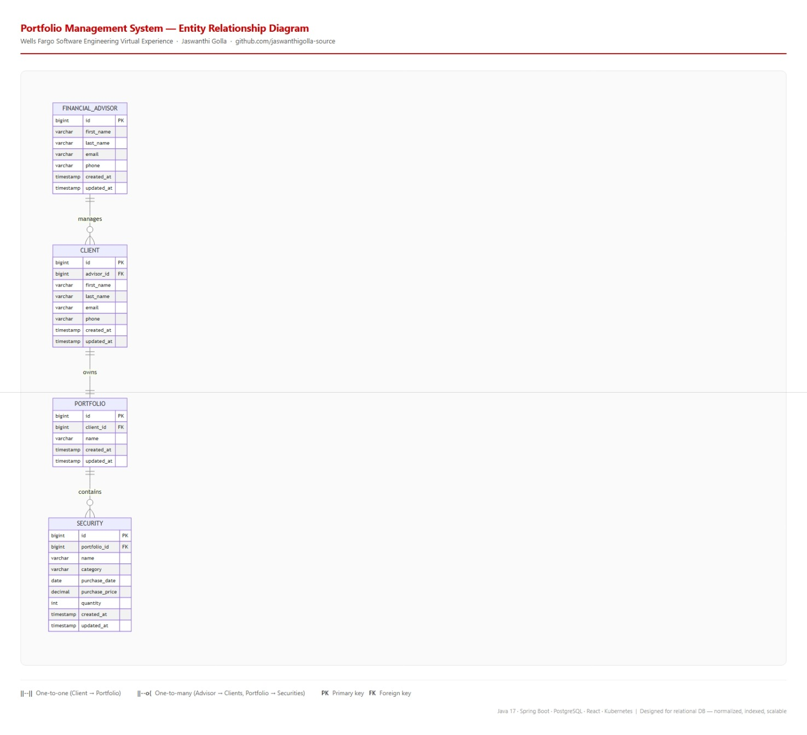

# Portfolio Management System — Entity Relationship Diagram

**Wells Fargo Software Engineering Virtual Experience**
Backend system design for a financial advisor portfolio management platform.

---

## System Overview

Relational data model for a multi-advisor portfolio management system. Financial advisors manage clients; each client owns a portfolio containing zero or more securities. Designed for a Spring Boot backend with PostgreSQL and a React dashboard.

---

## ERD


---

## Entities & Attributes

### FINANCIAL_ADVISOR
| Column | Type | Notes |
|--------|------|-------|
| id | BIGINT | PK, auto-increment |
| first_name | VARCHAR(100) | NOT NULL |
| last_name | VARCHAR(100) | NOT NULL |
| email | VARCHAR(255) | UNIQUE, NOT NULL |
| phone | VARCHAR(20) | |
| created_at | TIMESTAMP | DEFAULT NOW() |
| updated_at | TIMESTAMP | ON UPDATE NOW() |

### CLIENT
| Column | Type | Notes |
|--------|------|-------|
| id | BIGINT | PK |
| advisor_id | BIGINT | FK → financial_advisor.id |
| first_name | VARCHAR(100) | NOT NULL |
| last_name | VARCHAR(100) | NOT NULL |
| email | VARCHAR(255) | UNIQUE, NOT NULL |
| phone | VARCHAR(20) | |
| created_at | TIMESTAMP | |
| updated_at | TIMESTAMP | |

### PORTFOLIO
| Column | Type | Notes |
|--------|------|-------|
| id | BIGINT | PK |
| client_id | BIGINT | FK → client.id, UNIQUE (1-to-1) |
| name | VARCHAR(255) | e.g. "Retirement Portfolio" |
| created_at | TIMESTAMP | |
| updated_at | TIMESTAMP | |

### SECURITY
| Column | Type | Notes |
|--------|------|-------|
| id | BIGINT | PK |
| portfolio_id | BIGINT | FK → portfolio.id |
| name | VARCHAR(255) | e.g. "Apple Inc." |
| category | VARCHAR(100) | e.g. Equity, Bond, ETF, Mutual Fund |
| purchase_date | DATE | NOT NULL |
| purchase_price | DECIMAL(15,4) | NOT NULL |
| quantity | INT | NOT NULL, CHECK > 0 |
| created_at | TIMESTAMP | |
| updated_at | TIMESTAMP | |

---

## Relationships

```
FINANCIAL_ADVISOR  ||--o{  CLIENT     : "manages (one advisor → many clients)"
CLIENT             ||--||  PORTFOLIO  : "owns (one client → exactly one portfolio)"
PORTFOLIO          ||--o{  SECURITY   : "contains (zero or more securities)"
```

### Why 1-to-1 between CLIENT and PORTFOLIO?
Each client has exactly one portfolio per the requirements: *"Each client will have a portfolio."* A 1:1 enforced via `UNIQUE(client_id)` on the portfolio table prevents orphaned portfolios and simplifies the advisor's dashboard view.

### Why BIGINT for PKs?
The system supports multiple advisors at enterprise scale. BIGINT (vs INT) future-proofs against row count limits in a high-scalability relational DB deployment.

### Why DECIMAL(15,4) for purchase_price?
Financial data requires precision. DECIMAL avoids floating-point rounding errors critical for price calculations — standard practice in fintech systems.

### What requirements were NOT modelled (and why)
The following requirements are **infrastructure/tech constraints**, not data model concerns:
- 99% uptime → handled by deployment/SLA (K8s HPA, multi-AZ)
- React dashboard → frontend layer, not DB schema
- Spring Boot backend → application layer
- Highly scalable → addressed via connection pooling, DB indexing, K8s scaling
- Business hours (9–5 weekdays) → application-layer access control, not schema

---

## Tech Stack (per requirements)

| Layer | Technology |
|-------|-----------|
| Backend | Java 17 + Spring Boot 3.x |
| API | REST (Spring MVC / Spring Data JPA) |
| Database | PostgreSQL (relational, normalized schema) |
| Frontend | React dashboard |
| Infrastructure | Kubernetes (HPA for scalability), 99% uptime SLA |

---

## Recommended Indexes

```sql
-- Advisor → client lookup (most frequent query)
CREATE INDEX idx_client_advisor_id ON client(advisor_id);

-- Portfolio → client lookup
CREATE INDEX idx_portfolio_client_id ON portfolio(client_id);

-- Security → portfolio lookup (dashboard load)
CREATE INDEX idx_security_portfolio_id ON security(portfolio_id);

-- Security category filter (analytics queries)
CREATE INDEX idx_security_category ON security(category);

-- Purchase date range queries
CREATE INDEX idx_security_purchase_date ON security(purchase_date);
```

---

## Related Work

This ERD reflects the same systems thinking applied in production:

- [event-driven-commerce-platform](https://github.com/jaswanthigolla-source/event-driven-commerce-platform) — production-grade microservices with Spring Boot, Kafka, Kubernetes, PostgreSQL, and GitHub Actions CI/CD. The domain entities (products, orders, customers) follow the same normalized relational design as this ERD.

- [microservices-observability-stack](https://github.com/jaswanthigolla-source/microservices-observability-stack) — Prometheus, Grafana, Loki, Jaeger instrumentation addressing the 99% uptime requirement at system level.

- [kubernetes-platform-lab](https://github.com/jaswanthigolla-source/kubernetes-platform-lab) — K8s namespaces, RBAC, HPA autoscaling — directly satisfies the "highly scalable" infrastructure requirement.

---

## About

**Jaswanthi Golla** — Backend Engineer, 2 YOE
- Built and owned microservices serving 4,300+ US stores at sub-100ms p99 Kafka latency
- Maintained 99.9% uptime across 400–500 service platform
- Stack: Java 17 · Spring Boot · Kafka · Kubernetes (EKS/ARO) · Prometheus/Grafana/Loki/Jaeger

[GitHub](https://github.com/jaswanthigolla-source) · [LinkedIn](https://linkedin.com/in/jaswanthi-golla)
